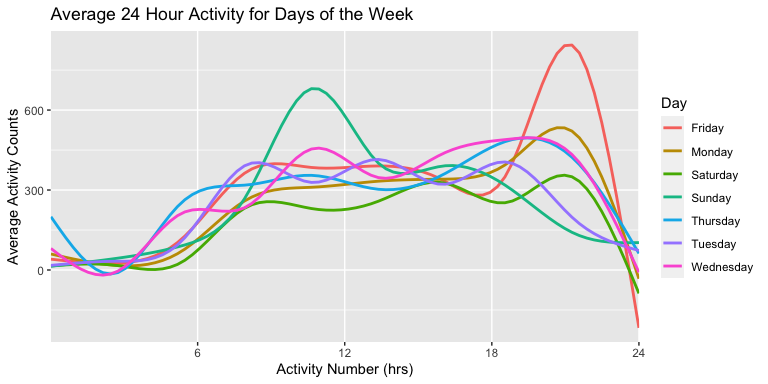

Homework 3
================
Teshawna Badu
10/20/2021

I’m an R Markdown document!

``` r
library(tidyverse)
```

    ## ── Attaching packages ─────────────────────────────────────── tidyverse 1.3.1 ──

    ## ✓ ggplot2 3.3.5     ✓ purrr   0.3.4
    ## ✓ tibble  3.1.4     ✓ dplyr   1.0.7
    ## ✓ tidyr   1.1.3     ✓ stringr 1.4.0
    ## ✓ readr   2.0.1     ✓ forcats 0.5.1

    ## ── Conflicts ────────────────────────────────────────── tidyverse_conflicts() ──
    ## x dplyr::filter() masks stats::filter()
    ## x dplyr::lag()    masks stats::lag()

``` r
library(dplyr)
library(p8105.datasets)
library(janitor)
```

    ## 
    ## Attaching package: 'janitor'

    ## The following objects are masked from 'package:stats':
    ## 
    ##     chisq.test, fisher.test

``` r
library(readr)
```

## Question 1

``` r
data("instacart")
```

Description: Instacart is an American company that operates in grocery
delivery and pick up services. The `instacart` dataset contains data
from 2017. It has 1384617 observations and 15 variables. The total
number of data points in this dataset is 20769255. The key variables in
this dataset include order\_id, product\_id, add\_to\_cart\_order,
reordered, user\_id, eval\_set, order\_number, order\_dow,
order\_hour\_of\_day, days\_since\_prior\_order, product\_name,
aisle\_id, department\_id, aisle, department.

### How many aisles are there and which are the most ordered from?

``` r
instacart %>% 
    count(aisle) %>% 
    arrange(desc(n))
```

    ## # A tibble: 134 × 2
    ##    aisle                              n
    ##    <chr>                          <int>
    ##  1 fresh vegetables              150609
    ##  2 fresh fruits                  150473
    ##  3 packaged vegetables fruits     78493
    ##  4 yogurt                         55240
    ##  5 packaged cheese                41699
    ##  6 water seltzer sparkling water  36617
    ##  7 milk                           32644
    ##  8 chips pretzels                 31269
    ##  9 soy lactosefree                26240
    ## 10 bread                          23635
    ## # … with 124 more rows

There are 134 `aisles`. The aisles with the most ordered-from items are
`fresh vegetables`, `fresh fruits`, and followed by
`packaged vegetables fruits`.

### make a plot

This plot shows the number of items ordered per aisle, limited to 10,000
items ordered.

``` r
instacart %>%
  count(aisle) %>%
  filter(n > 10000) %>%
  ggplot(aes(forcats::fct_reorder(aisle, (n)), n)) +
  geom_col() +
  coord_flip() +
  labs(
    title = "Number of items ordered per aisle",
    x = "Aisle name",
    y = "Number of items ordered",
    caption = "Data from instacart limited to aisles with more than 10,000 items ordered"
  )
```

<!-- -->

### make a table

This table shows three most popular items in each of the aisles “baking
ingredients”, “dog food care”, and “packaged vegetables fruits”,
Including the number of times each item is ordered.

``` r
instacart %>%
  filter(aisle == "baking ingredients" | 
           aisle == "dog food care" | 
           aisle == "packaged vegetables fruits") %>%
 count(aisle, product_name) %>%
  arrange(desc(n)) %>%
  group_by(aisle) %>%
  slice(1:3) %>%
  arrange(desc(n)) %>%
  group_by(aisle) %>%
  knitr::kable(caption = "Top  3  Items Per Aisle")
```

| aisle                      | product\_name                                 |    n |
|:---------------------------|:----------------------------------------------|-----:|
| packaged vegetables fruits | Organic Baby Spinach                          | 9784 |
| packaged vegetables fruits | Organic Raspberries                           | 5546 |
| packaged vegetables fruits | Organic Blueberries                           | 4966 |
| baking ingredients         | Light Brown Sugar                             |  499 |
| baking ingredients         | Pure Baking Soda                              |  387 |
| baking ingredients         | Cane Sugar                                    |  336 |
| dog food care              | Snack Sticks Chicken & Rice Recipe Dog Treats |   30 |
| dog food care              | Organix Chicken & Brown Rice Recipe           |   28 |
| dog food care              | Small Dog Biscuits                            |   26 |

Top 3 Items Per Aisle

The table shows that `organic baby spinach`, `organic raspberries`, and
`organic blueberries` are the top three ordered items from the
`packaged vegetables fruits` aisle. From the `baking ingredients` aisle,
`light brown sugar`, `pure baking soda`, and `cane sugar` are the top
three ordered items. The top three ordered items from the
`dog food care` aisle
are`snack sticks chicken & rice recipe dog treats`,
`organix chicken & brown rice recipe`, and `small dog biscuits`.

### 2x7 table showing the mean hour of the day at which Pink Lady Apples and Coffee Ice Cream are ordered on each day of the week.

``` r
 instacart %>% 
    filter(product_name %in% c("Pink Lady Apples", "Coffee Ice Cream")) %>% 
    group_by(product_name, order_dow) %>% 
    summarize(mean_hour = mean(order_hour_of_day)) %>% 
    pivot_wider(
        names_from = order_dow,
        values_from = mean_hour
  ) %>%
  rename( "Sunday" = "0","Monday" = "1", "Tuesday" = "2", "Wednesday" = "3", "Thursday" = "4", "Friday" = "5", "Saturday" = "6") %>% 
  knitr::kable(caption = "Mean Hour of Day Ordered")
```

    ## `summarise()` has grouped output by 'product_name'. You can override using the `.groups` argument.

| product\_name    |   Sunday |   Monday |  Tuesday | Wednesday | Thursday |   Friday | Saturday |
|:-----------------|---------:|---------:|---------:|----------:|---------:|---------:|---------:|
| Coffee Ice Cream | 13.77419 | 14.31579 | 15.38095 |  15.31818 | 15.21739 | 12.26316 | 13.83333 |
| Pink Lady Apples | 13.44118 | 11.36000 | 11.70213 |  14.25000 | 11.55172 | 12.78431 | 11.93750 |

Mean Hour of Day Ordered

`Coffee Ice Cream` is ordered, on average, later in the day than
`Pink Lady Apples`.

## Question 2

I will clean the data `brfss_smart2010`, formatting to use appropriate
variable names, focusing on the `Overall Health` topic, and only
including factored responses ordered from`Poor` to `Excellent`.

``` r
data("brfss_smart2010")
brfss_cleaned_version = brfss_smart2010 %>% 
  janitor::clean_names() %>%
  filter(topic %in% c("Overall Health")) %>%
  mutate(response = factor(response, levels = c("Poor", "Fair", "Good", "Very good", "Excellent"))) %>%
  arrange(response) %>%
  filter(response %in% c("Excellent", "Very good", "Good", "Fair", "Poor")) %>%
  separate(locationdesc, into = c('state', 'location'), sep = ' - ')
```

### In 2002, which states were observed at 7 or more locations?

``` r
states_2002 = brfss_cleaned_version %>% 
  filter(year == "2002") %>% 
  group_by(state) %>% 
  distinct(location) %>% 
  count(state) %>% 
  filter(n >= 7) %>% 
  select(state)
```

### In 2010, which states were observed at 7 or more locations?

``` r
states_2010 = brfss_cleaned_version %>% 
  filter(year == "2010") %>% 
  group_by(state) %>% 
  distinct(location) %>% 
  count(state) %>% 
  filter(n >= 7) %>% 
  select(state)
```

The states that were observed at 7 or more locations in 2002 were CT,
FL, MA, NC, NJ, PA. The states that were observed at 7 or more locations
in 2010 were CA, CO, FL, MA, MD, NC, NE, NJ, NY, OH, PA, SC, TX, WA.

### Plot

I will construct a dataset that is limited to Excellent responses, and
contains, year, state, and a variable that averages the data\_value
across locations within a state.Additionally I will make a “spaghetti”
plot of this average value over time within a state (that is, make a
plot showing a line for each state across years – the geom\_line
geometry and group aesthetic will help).

``` r
Excellent_df = brfss_cleaned_version %>%
  filter(response %in% "Excellent") %>%
  select(year, locationabbr, data_value) %>%
  unique() %>%
  na.omit() %>%
  group_by(locationabbr, year) %>%
  mutate(
    avg_data_value = mean(data_value)) %>%
  select(year, locationabbr, avg_data_value) %>%
  distinct()
Excellent_df %>%
  ggplot(aes(x = year, y = avg_data_value)) +
  geom_line(aes(group = locationabbr, color = locationabbr)) +
  labs(
    title = "Average data value over time for statess",
    x = "Year",
    y = "Average Data Value") +
  guides(col = guide_legend("State")) +
  theme(legend.position = "right")
```

<!-- -->

### Make two panel showing

I will make a two-panel plot showing, for the years 2006, and 2010,
distribution of data\_value for responses (“Poor” to “Excellent”) among
locations in NY State.

``` r
brfss_panels = brfss_cleaned_version %>% 
  filter(year %in% c(2006,2010),
  state == "NY") 
ggplot(brfss_panels, aes(x = response, y = data_value, fill = response)) + 
  geom_boxplot() + 
  facet_grid(. ~ year) +
  labs(
    title = "Distribution of data_value for responses in NY",
    x = "Response",
    y = "data_value",
    caption = "Data from the brfss dataset"
  )
```

<!-- -->

## Question 3

``` r
accel_data = read_csv("./accel_data.csv")
```

    ## Rows: 35 Columns: 1443

    ## ── Column specification ────────────────────────────────────────────────────────
    ## Delimiter: ","
    ## chr    (1): day
    ## dbl (1442): week, day_id, activity.1, activity.2, activity.3, activity.4, ac...

    ## 
    ## ℹ Use `spec()` to retrieve the full column specification for this data.
    ## ℹ Specify the column types or set `show_col_types = FALSE` to quiet this message.

I will load, tidy, and otherwise wrangle the data. The final dataset
should include all originally observed variables and values; have useful
variable names; include a weekday vs weekend variable; and encode data
with reasonable variable classes. Describe the resulting dataset
(e.g. what variables exist, how many observations, etc).

``` r
accel_df = accel_data %>% 
  pivot_longer(
    cols = activity.1:activity.1440,
    names_to = "activity_number",
    values_to = "activity_counts",
    names_prefix = "activity.",
  ) %>% 
  mutate(
    is_weekend = (day == "Saturday" | day == "Sunday")
    )
```

The tidied dataset `accel_df` contains 50400 rows (or observations) and
6 variables. The dataset’s 6 variables include the following: week,
day\_id, day, activity\_number, activity\_counts, is\_weekend

### Inspecting daily activity

Using your tidied dataset, aggregate accross minutes to create a total
activity variable for each day, and create a table showing these totals.
Are any trends apparent?

``` r
total_activity = 
  accel_df %>% 
  group_by(day_id) %>% 
  summarize(total_activity_counts = sum(activity_counts))
knitr::kable(total_activity)
```

| day\_id | total\_activity\_counts |
|--------:|------------------------:|
|       1 |               480542.62 |
|       2 |                78828.07 |
|       3 |               376254.00 |
|       4 |               631105.00 |
|       5 |               355923.64 |
|       6 |               307094.24 |
|       7 |               340115.01 |
|       8 |               568839.00 |
|       9 |               295431.00 |
|      10 |               607175.00 |
|      11 |               422018.00 |
|      12 |               474048.00 |
|      13 |               423245.00 |
|      14 |               440962.00 |
|      15 |               467420.00 |
|      16 |               685910.00 |
|      17 |               382928.00 |
|      18 |               467052.00 |
|      19 |               371230.00 |
|      20 |               381507.00 |
|      21 |               468869.00 |
|      22 |               154049.00 |
|      23 |               409450.00 |
|      24 |                 1440.00 |
|      25 |               260617.00 |
|      26 |               340291.00 |
|      27 |               319568.00 |
|      28 |               434460.00 |
|      29 |               620860.00 |
|      30 |               389080.00 |
|      31 |                 1440.00 |
|      32 |               138421.00 |
|      33 |               549658.00 |
|      34 |               367824.00 |
|      35 |               445366.00 |

The total activity counts are does not have a distinct pattern, the
counts fluctuate every couple of days.

### Panel

Accelerometer data allows the inspection activity over the course of the
day. Make a single-panel plot that shows the 24-hour activity time
courses for each day and use color to indicate day of the week. Describe
in words any patterns or conclusions you can make based on this graph.

``` r
accel_df %>% 
  mutate(activity_number = as.numeric(activity_number)) %>% 
  group_by(day, activity_number) %>% 
  summarize(avg_value = mean(activity_counts)) %>% 
  ggplot(aes(x = activity_number, y = avg_value, color = day)) +
  geom_smooth(se = FALSE) +
  scale_x_discrete(limit = c(360,720,1080,1440), 
                   labels = c( "6", "12", "18", "24")) +
  labs(
    title = "Average 24 Hour Activity for Days of the Week",
    x = "Activity Number (hrs)",
    y = "Average Activity Counts",
    color = "Day"
  )
```

    ## `summarise()` has grouped output by 'day'. You can override using the `.groups` argument.

    ## Warning: Continuous limits supplied to discrete scale.
    ## Did you mean `limits = factor(...)` or `scale_*_continuous()`?

    ## `geom_smooth()` using method = 'gam' and formula 'y ~ s(x, bs = "cs")'

<!-- -->

On average, activity counts for all days in a week are at lowest during
23:50 p.m. to 6:00 a.m. There are peaks of average activity counts at
around 10:30 a.m of Thurdsay and around 21:00 p.m of Friday. The low
levels may be due to sleeping and inability to be active, while the high
peaks may be due to daytime and having some free time to exercise.
